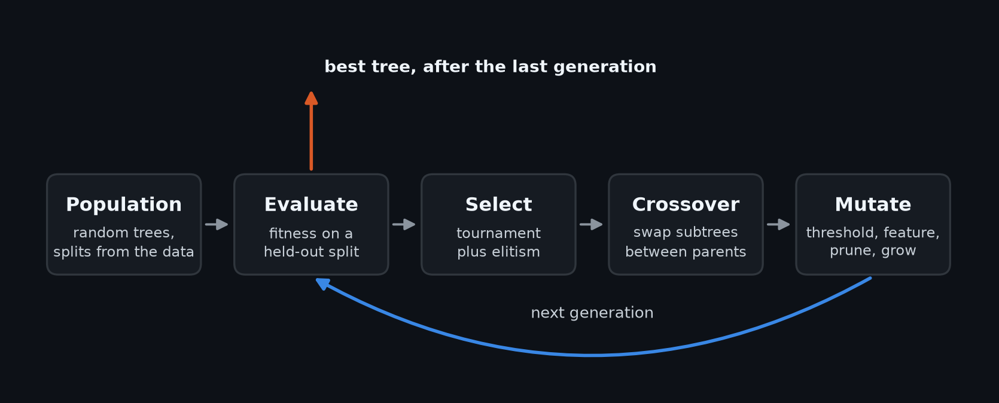
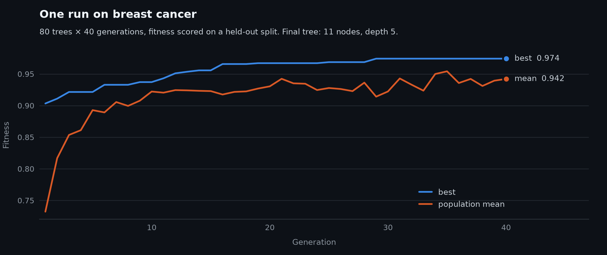

# 🌳 GA-Optimized Decision Trees

[](https://github.com/ibrah5em/ga-optimized-trees/actions/workflows/ci.yml)
[](https://opensource.org/licenses/MIT)
[](https://www.python.org/downloads/)
[](https://ibrah5em.github.io/ga-optimized-trees/)

A Python framework for evolving decision trees with a genetic algorithm.

CART grows a tree one greedy split at a time and prunes it afterwards. This framework
searches over whole trees instead, so the objective can be anything you can compute from a
tree: accuracy, node count, features used, path length, or your own metric. Run it with one
weighted objective, or with NSGA-II to get the whole accuracy–size trade-off from a single
run and pick the tree you want.



## What's in the box

- **Two search modes.** A weighted single-objective GA, and NSGA-II multi-objective search
  that returns a Pareto front.
- **Fitness on held-out data.** Pass a validation split and the search scores trees on data
  it didn't fit the leaves on, so it doesn't reward memorisation.
- **Splits that come from the data.** Given the training data, thresholds are drawn from
  values that actually reach a node, so a mutation always changes how the data is split.
- **Four mutation operators and subtree crossover:** nudge a threshold, swap a split's
  feature, prune a subtree to a leaf, grow a leaf into a split.
- **Constraint repair** (optional) that keeps `min_samples_split` / `min_samples_leaf`
  true after every crossover and mutation, not just at initialisation.
- **A benchmarking harness:** nested cross-validation, baselines matched to the GA's exact
  evaluation budget, CART's full pruning path, hypervolume, and across-dataset statistics.
- **Dataset loading** from scikit-learn, OpenML (including a 20-dataset CC-18 benchmark
  set), CSV and Excel.
- **YAML configs**, so a run is described by one file.

## Install

```bash
git clone https://github.com/ibrah5em/ga-optimized-trees.git
cd ga-optimized-trees
python -m venv venv
source venv/bin/activate  # Windows: venv\Scripts\activate

pip install -e .           # core
pip install -e .[all]      # plots, Optuna, XGBoost/LightGBM baselines, SHAP/LIME
pip install -e .[dev]      # tests and linting
```

CI tests Python 3.9–3.12 on Linux, and 3.11 on macOS and Windows.

## Quick start

From the command line:

```bash
python scripts/train.py --config configs/default.yaml --dataset breast_cancer
```

From Python. This runs in a few seconds and prints
`11 nodes, depth 5, test accuracy 0.939`:

```python
import numpy as np
from sklearn.model_selection import train_test_split

from ga_trees import FitnessCalculator, GAConfig, GAEngine, Mutation, TreeInitializer
from ga_trees.data import DatasetLoader
from ga_trees.fitness import TreePredictor

data = DatasetLoader().load_dataset("breast_cancer", test_size=0.2)
X_train, y_train = data["X_train"], data["y_train"]

# Hold a slice of the training data out of the search. Without it the GA fits
# and scores leaves on the same rows and rewards whichever tree overfits most.
X_fit, X_val, y_fit, y_val = train_test_split(
    X_train, y_train, test_size=0.25, stratify=y_train, random_state=0
)
n_features = X_fit.shape[1]

initializer = TreeInitializer(
    n_features, n_classes=2, max_depth=5, min_samples_split=10, min_samples_leaf=5
)
mutation = Mutation(
    n_features,
    feature_ranges={
        i: (X_fit[:, i].min(), X_fit[:, i].max()) for i in range(n_features)
    },
    X=X_fit,  # lets mutation pick thresholds from values that actually reach the node
    min_samples_leaf=5,
)
fitness = FitnessCalculator(accuracy_weight=0.9, interpretability_weight=0.1)

engine = GAEngine(
    GAConfig(population_size=80, n_generations=40, random_state=42),
    initializer,
    fitness.calculate_fitness,
    mutation,
)
best = engine.evolve(X_fit, y_fit, X_val=X_val, y_val=y_val, verbose=False)

# Structure was chosen on the validation split; refit the leaves on all training rows.
predictor = TreePredictor()
predictor.fit_leaf_predictions(best, X_train, y_train)
accuracy = np.mean(predictor.predict(best, data["X_test"]) == data["y_test"])
print(
    f"{best.get_num_nodes()} nodes, depth {best.get_depth()}, test accuracy {accuracy:.3f}"
)
```

Here's what that run looks like, generation by generation:



Two settings matter more than they look:

- **Pass `X_val`.** Without it, fitness is resubstitution and the search chases overfitting.
- **Keep `interpretability_weight` small.** At 0.35, a tree has to gain about 23 accuracy
  points before growing from a stump to CART's size pays off, so the GA settles on stumps.
  Start around 0.1 and raise it if the trees come out too big.

## Multi-objective: get the whole trade-off

NSGA-II returns every tree on the accuracy–size front, so you choose the operating point
after the run instead of guessing a weight before it. Continuing from the example above:

```python
from ga_trees.ga import ParetoOptimizer

calculator = FitnessCalculator()


def objectives(tree, X, y):
    """Validation accuracy up, node count down (negated: NSGA-II maximises both)."""
    calculator.calculate_fitness(tree, X, y, X_val, y_val)
    return tree.accuracy_, -tree.get_num_nodes()


optimizer = ParetoOptimizer(
    initializer=initializer,
    fitness_fn=objectives,
    mutation_fn=lambda tree: mutation.mutate(tree, GAConfig().mutation_types),
    random_state=42,
)
front = optimizer.evolve_pareto_front(
    X_fit, y_fit, population_size=80, n_generations=40
)

points = sorted({(t.get_num_nodes(), round(t.accuracy_, 3)) for t in front})
for nodes, acc in points:
    print(f"{nodes:3d} nodes  validation accuracy {acc:.3f}")
```

```
  1 nodes  validation accuracy 0.623
  3 nodes  validation accuracy 0.921
  5 nodes  validation accuracy 0.974
```

## When to use it

If all you need is the most accurate small tree on plain accuracy, use CART. It's faster
and hard to beat at its own game.

Use this framework when the objective is something a greedy split rule can't target
directly: a cap on distinct features, a feature-cost budget, a custom metric over the whole
tree, or when you want the full accuracy–size front to choose from.

## Configs

Every script takes `--config`:

| Config                          | What it's for                                                |
| ------------------------------- | ------------------------------------------------------------ |
| `default.yaml`                  | General-purpose starting point                               |
| `fast.yaml`                     | Small population, few generations, for quick iteration       |
| `accuracy_focused.yaml`         | Weight mostly on accuracy, bigger budget                     |
| `balanced.yaml`                 | Equal weight on accuracy and the size heuristic              |
| `interpretability_focused.yaml` | Weight mostly on the size heuristic; expect very small trees |
| `optimized.yaml`                | GA settings from an earlier Optuna search, not re-validated  |
| `paper.yaml`                    | The benchmark configuration: 20 CC-18 datasets, nested CV    |
| `paper-repair.yaml`             | Same, with constraint repair on                              |

## Benchmarking

The harness in `ga_trees.benchmark` compares the GA with CART and random search on equal
terms: nested cross-validation, the same tree space, and an exactly matched number of
evaluations.

```bash
# One tuned tree per method, nested CV
python scripts/benchmark.py --config configs/paper.yaml --datasets wdbc,vehicle --n-jobs 4

# Accuracy–size frontiers, compared by hypervolume
python scripts/frontier_benchmark.py --config configs/paper.yaml --datasets wdbc,vehicle
```

Leave out `--datasets` to run the full 20-dataset set. That takes hours.

## Research paper

A paper on the full study behind this framework is in preparation: the method, a
pre-registered benchmark on 20 OpenML-CC18 datasets against CART and random search, and the
results. It'll be linked here when it's out. Until then, please cite the software:

```bibtex
@software{hasaki2025gatrees,
  title  = {GA-Optimized Decision Trees},
  author = {Hasaki, Ibrahem},
  year   = {2025},
  url    = {https://github.com/ibrah5em/ga-optimized-trees},
  note   = {MIT License}
}
```

Earlier versions of this README quoted benchmark numbers ("46–82% smaller trees at
equivalent accuracy") that didn't survive an audit. They've been withdrawn; the paper will
carry the real results.

## Project layout

```
src/ga_trees/
├── genotype/     tree representation
├── ga/           engine, operators, NSGA-II, split points, constraint repair
├── fitness/      prediction and the fitness function
├── benchmark/    nested CV, frontiers and baselines
├── evaluation/   hypervolume, statistics, metrics, visualisation
├── baselines/    CART, random forest, XGBoost wrappers
└── data/         dataset loading (scikit-learn, OpenML, CSV, Excel)
scripts/          command-line entry points
configs/          YAML configs
tests/            unit and integration tests
docs/             documentation site source
```

## Development

```bash
pip install -e .[dev]
pre-commit install
pytest tests/ -v
pytest tests/unit/ --cov=src/ga_trees --cov-fail-under=80
```

The README figures are generated by `python scripts/readme_figures.py`. See
[CONTRIBUTING.md](CONTRIBUTING.md) for the rest, and the
**[docs site](https://ibrah5em.github.io/ga-optimized-trees/)** for the full API.

## License

MIT, see [LICENSE](LICENSE). Copyright (c) 2025 Ibrahem Hasaki and LuF8y.

Built on [DEAP](https://github.com/DEAP/deap), [scikit-learn](https://scikit-learn.org/),
[Matplotlib](https://matplotlib.org/) and [Seaborn](https://seaborn.pydata.org/). Thanks to
Leen Khalil and Yousef Deeb for their support.
