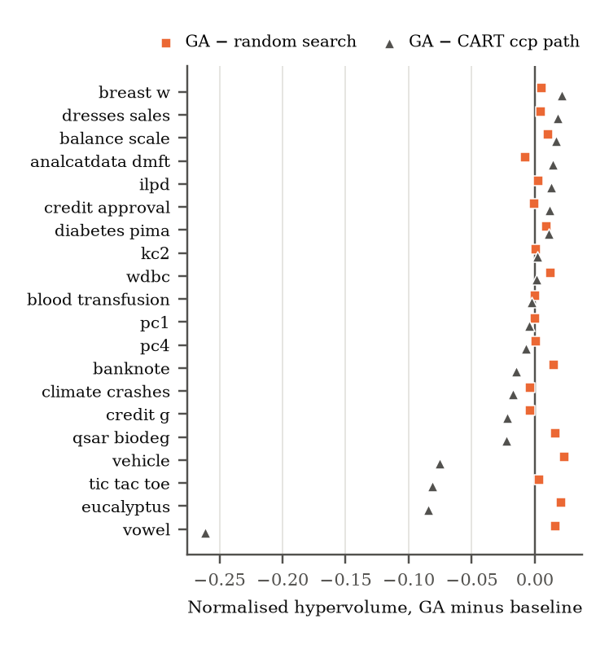
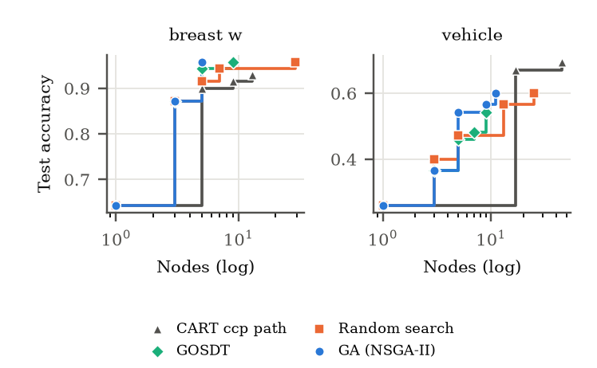
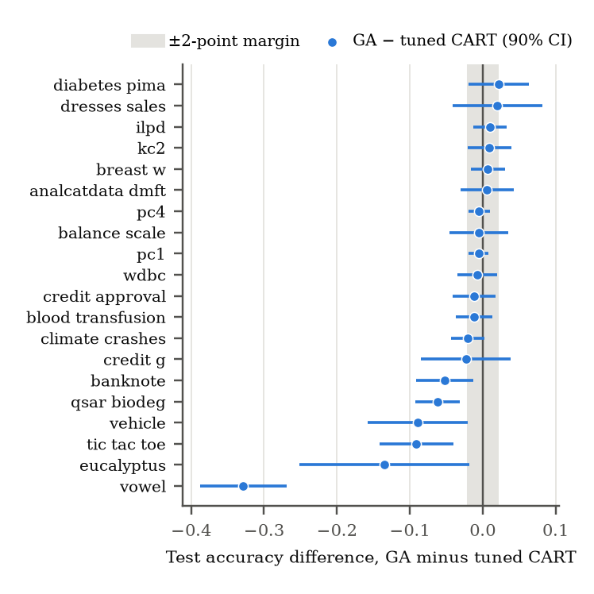

# Results

These are the results of the pre-registered benchmark: 20 OpenML-CC18 datasets, 10-fold
outer cross-validation, with hypotheses and kill criteria fixed in
`paper/PREREGISTRATION.md` before anything ran. Every number here is copied from the tables
`scripts/paper_assets.py` generates from the run data in `paper/evidence/`, the same ones
the papers use.

## Verdicts

| Kill criterion                         | Outcome                                                                          |
| -------------------------------------- | -------------------------------------------------------------------------------- |
| **K1** — random search matches the GA  | **Not triggered.** GA ahead by +0.66 hypervolume, p_holm = 0.032, 15/20 datasets |
| **K2** — GA fails to dominate CART     | **Triggered.** 45% dominance over CART's pruning path; threshold 60%             |
| **K3** — accuracy loss vs CART > 2%    | **Triggered.** 8/20 datasets lose > 2 points (threshold 6/20); H2 rejected       |
| **K4** — composite score as an outcome | **Held.** It appears in no reported measure                                      |

What that supports: over the same tree space and an exactly matched evaluation budget,
evolution finds a better accuracy–complexity frontier than random sampling. It does not beat
CART's cost-complexity pruning path, and a tuned GA tree is not as accurate as tuned CART.

## Frontiers (K1, K2)

Each method produces a set of trees per fold, scored on the test fold by accuracy and node
count. Hypervolume measures how much of that plane a method's frontier covers.

Mean normalised hypervolume per dataset (higher is better; best of GA, random search and
CART in bold), and the mean node count of the largest tree on each front. GOSDT ran on a
subset of folds with its own reference point, so its column isn't on the same scale.

| Dataset           |        GA | Random search | CART path | GOSDT | Largest GA tree | Largest CART tree |
| ----------------- | --------: | ------------: | --------: | ----: | --------------: | ----------------: |
| analcatdata_dmft  |     0.237 |     **0.245** |     0.223 | 0.228 |               6 |                94 |
| balance_scale     | **0.749** |         0.738 |     0.732 | 0.704 |              13 |                39 |
| banknote          |     0.894 |         0.879 | **0.909** | 0.890 |              13 |                29 |
| blood_transfusion |     0.782 |         0.781 | **0.784** | 0.775 |               6 |                32 |
| breast_w          | **0.906** |         0.901 |     0.884 | 0.861 |               5 |                13 |
| climate_crashes   |     0.892 |         0.896 | **0.910** | 0.895 |               2 |                10 |
| credit_approval   |     0.840 |     **0.840** |     0.828 | 0.780 |               4 |                22 |
| credit_g          |     0.723 |         0.727 | **0.744** | 0.729 |               5 |                48 |
| diabetes_pima     | **0.744** |         0.734 |     0.732 | 0.758 |               6 |                32 |
| dresses_sales     | **0.620** |         0.615 |     0.602 | 0.602 |               5 |                36 |
| eucalyptus        |     0.521 |         0.500 | **0.606** | 0.509 |              12 |                63 |
| ilpd              | **0.723** |         0.721 |     0.710 | 0.709 |               4 |                13 |
| kc2               | **0.827** |         0.826 |     0.825 | 0.838 |               3 |                13 |
| pc1               |     0.919 |         0.919 | **0.924** | 0.921 |               2 |                16 |
| pc4               |     0.887 |         0.886 | **0.893** | 0.892 |               4 |                23 |
| qsar_biodeg       |     0.789 |         0.773 | **0.812** |    -- |               9 |                45 |
| tic_tac_toe       |     0.744 |         0.740 | **0.825** | 0.800 |              10 |               118 |
| vehicle           |     0.594 |         0.570 | **0.669** | 0.603 |              14 |                77 |
| vowel             |     0.360 |         0.343 | **0.621** | 0.399 |              24 |               155 |
| wdbc              | **0.899** |         0.886 |     0.898 | 0.829 |               5 |                11 |

## A single tuned tree (K3)

Both methods tuned by inner CV, then scored once on each outer test fold. Δ is GA minus
CART, with a 90% Nadeau–Bengio interval.

| Dataset           |    GA |  CART |      Δ | 90% CI low | 90% CI high | Leaves GA / CART | Loses > 2 pts |
| ----------------- | ----: | ----: | -----: | ---------: | ----------: | ---------------: | ------------: |
| vowel             | 0.382 | 0.710 | −0.328 |     −0.388 |      −0.269 |      20.7 / 60.4 |             ✓ |
| eucalyptus        | 0.497 | 0.632 | −0.135 |     −0.251 |      −0.018 |       8.7 / 19.7 |             ✓ |
| tic_tac_toe       | 0.764 | 0.855 | −0.091 |     −0.141 |      −0.040 |      12.4 / 57.0 |             ✓ |
| vehicle           | 0.604 | 0.693 | −0.089 |     −0.157 |      −0.021 |      11.8 / 26.7 |             ✓ |
| qsar_biodeg       | 0.761 | 0.823 | −0.062 |     −0.092 |      −0.031 |       5.4 / 17.2 |             ✓ |
| banknote          | 0.929 | 0.980 | −0.052 |     −0.091 |      −0.013 |       8.1 / 21.0 |             ✓ |
| credit_g          | 0.700 | 0.723 | −0.023 |     −0.085 |      +0.039 |       3.0 / 11.5 |             ✓ |
| climate_crashes   | 0.915 | 0.935 | −0.020 |     −0.043 |      +0.002 |        2.0 / 7.3 |             ✓ |
| blood_transfusion | 0.763 | 0.775 | −0.012 |     −0.037 |      +0.013 |       2.0 / 11.8 |               |
| credit_approval   | 0.849 | 0.861 | −0.012 |     −0.041 |      +0.018 |        2.9 / 9.7 |               |
| wdbc              | 0.923 | 0.930 | −0.007 |     −0.034 |      +0.020 |        4.2 / 8.1 |               |
| pc1               | 0.928 | 0.933 | −0.005 |     −0.019 |      +0.008 |        3.0 / 9.7 |               |
| balance_scale     | 0.784 | 0.789 | −0.005 |     −0.046 |      +0.036 |      13.3 / 20.3 |               |
| pc4               | 0.890 | 0.895 | −0.005 |     −0.019 |      +0.010 |        2.4 / 8.3 |               |
| analcatdata_dmft  | 0.211 | 0.204 | +0.006 |     −0.031 |      +0.043 |       9.8 / 41.0 |               |
| breast_w          | 0.954 | 0.947 | +0.007 |     −0.016 |      +0.031 |       4.8 / 11.5 |               |
| kc2               | 0.849 | 0.839 | +0.010 |     −0.021 |      +0.040 |        2.8 / 6.4 |               |
| ilpd              | 0.717 | 0.707 | +0.010 |     −0.013 |      +0.033 |        2.2 / 2.9 |               |
| dresses_sales     | 0.598 | 0.578 | +0.020 |     −0.042 |      +0.082 |        4.2 / 4.1 |               |
| diabetes_pima     | 0.742 | 0.720 | +0.022 |     −0.019 |      +0.063 |       3.0 / 12.6 |               |

## Why the GA loses where it loses

The K2 and K3 losses fall on the same datasets: problems where accuracy keeps rising with
tree size. The GA's fronts stop at a median of 5.4 nodes against CART's 32, and across
datasets its hypervolume deficit tracks the accuracy only larger trees reach (Spearman 0.85).

An exploratory ablation on the four worst datasets, one factor at a time (first 10 outer
folds; HV = normalised hypervolume, max nodes = largest delivered tree). The control arm
reproduces the committed GA runs exactly.

| Arm                 | eucalyptus HV | max nodes | tic_tac_toe HV | max nodes | vehicle HV | max nodes | vowel HV | max nodes |
| ------------------- | ------------: | --------: | -------------: | --------: | ---------: | --------: | -------: | --------: |
| GA (control)        |         0.525 |        11 |          0.744 |        13 |      0.606 |        14 |    0.363 |        25 |
| No validation split |         0.537 |        20 |          0.773 |        16 |      0.637 |        16 |    0.384 |        33 |
| No small-tree bias  |         0.518 |        17 |          0.749 |        20 |      0.594 |        18 |    0.384 |        40 |
| 2× budget           |         0.538 |        15 |          0.771 |        15 |      0.629 |        16 |    0.407 |        27 |
| Random search       |         0.498 |        25 |          0.745 |        14 |      0.574 |        37 |    0.340 |        46 |
| CART ccp path       |         0.608 |        78 |          0.820 |       133 |      0.661 |        89 |    0.619 |       162 |

Dropping the validation split closes 29% of the gap to CART, doubling the budget 28%, and
removing the small-tree bias in initialisation and mutation nothing. Delivered trees stay at
15–40 nodes in every arm against CART's 78–162, so most of the truncation is still
unexplained.

## Robustness checks

All run after K1/K2 were known, so none of them can change a verdict, and none did.

| Check                                      | Result                                                               |
| ------------------------------------------ | -------------------------------------------------------------------- |
| Constraint repair on                       | K1 +0.85 (p_holm 0.034), K2 45% — unchanged                          |
| CART path capped at the GA's depth         | GA dominance 40% — the depth asymmetry does not explain K2           |
| GOSDT regularisation path (19/20 datasets) | Beats CART's path on 7/19; GA vs GOSDT not significant (p_holm 0.98) |
| Reproduction of the committed frontier run | Bit-identical on the datasets re-run, all 20 datasets' data verified |

## Earlier results

This page used to carry per-dataset tables for iris, wine and breast cancer. They were
withdrawn: the size reductions were measured against unpruned CART, the "equivalence" came
from t-tests across dependent folds, and the headline figures were never produced by a run.
`paper/CLAIMS.md` has the audit.
